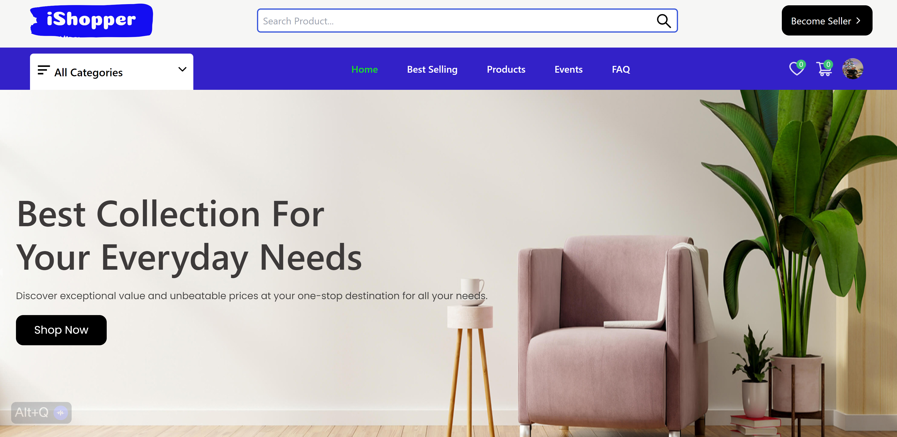

<div align="center" id="top">
  
  &#xa0;
  <br />
  

<a href="https://jj-ecommerce-5.vercel.app">Demo</a>

</div>

<h1 align="center">iShopper</h1>

<p align="center">
  

  

  

  
</p>

<p align="center">
  <a href="#dart-about">About</a> &#xa0; | &#xa0;
  <a href="#sparkles-features">Features</a> &#xa0; | &#xa0;
  <a href="#rocket-technologies">Technologies</a> &#xa0; | &#xa0;
  <a href="#white_check_mark-requirements">Requirements</a> &#xa0; | &#xa0;
  <a href="#checkered_flag-starting">Starting</a> &#xa0; | &#xa0;
  <a href="#memo-license">License</a> &#xa0; | &#xa0;
  <a href="https://github.com/jeffjiang13" target="_blank">Author</a>
</p>

<br>

## :dart: About

iShopper is a full-featured e-commerce platform developed using the MERN stack. The platform is designed to provide an intuitive and convenient shopping experience, with a vast selection of products available for purchase.

One of iShopper's key features is the smooth checkout process, enabling customers to make purchases with ease. The platform supports multiple vendors, making it a versatile solution for businesses of various sizes. The integrated admin dashboard provides comprehensive management capabilities, from product inventory control to sales tracking and customer engagement.

In addition, iShopper boasts a reliable payment integration system, ensuring secure and hassle-free transactions. This feature reinforces user trust and enhances overall customer satisfaction.

The primary aim of iShopper is to bridge the gap between businesses and customers by offering an efficient, secure, and user-friendly online shopping platform. Whether you're a small business venturing into e-commerce or a large enterprise looking for a robust online sales platform, iShopper is designed to cater to your needs.

In essence, iShopper stands as a testament to the potential of contemporary web technologies in creating dynamic and efficient e-commerce solutions.

## :sparkles: Features

:heavy_check_mark: User-friendly interface;\
:heavy_check_mark: Wide range of products;\
:heavy_check_mark: Seamless checkout process;\
:heavy_check_mark: Multi-vendor;\
:heavy_check_mark: Admin dashboard;\
:heavy_check_mark: Payment integration;

## :rocket: Technologies

The following tools were used in this project:

- [MongoDB](https://www.mongodb.com/)
- [Express](https://expressjs.com/)
- [React](https://reactjs.org/)
- [Node.js](https://nodejs.org/en/)
- [JavaScript](https://developer.mozilla.org/en-US/docs/Web/JavaScript)

## :white_check_mark: Requirements

Before starting :checkered_flag:, you need to have [Git](https://git-scm.com) and [Node](https://nodejs.org/en/) installed.

## :checkered_flag: Starting

```bash
# Clone this project
$ git clone https://github.com/jeffjiang13/ecommerce-5

# Access
$ cd ecommerce-5

# Install dependencies
$ yarn

# Run the project
$ yarn start

# The server will initialize in the <http://localhost:3000>
```

## memo: License

This project is under license from MIT. For more details, see the LICENSE file.

Made with :heart: by <a href="https://github.com/jeffjiang13/ecommerce-5" >Jeff Jiang </a>
